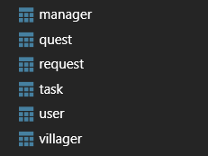
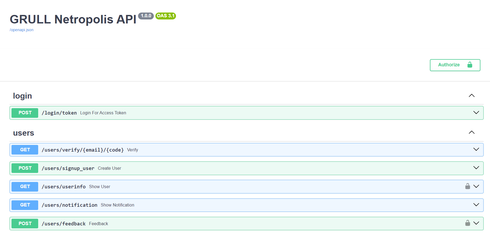
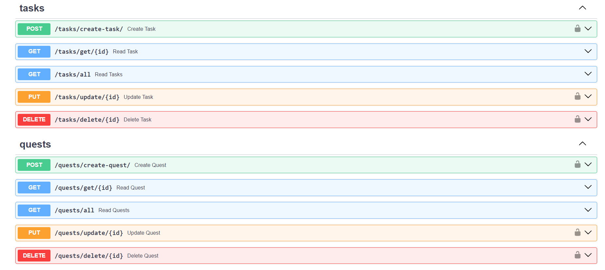
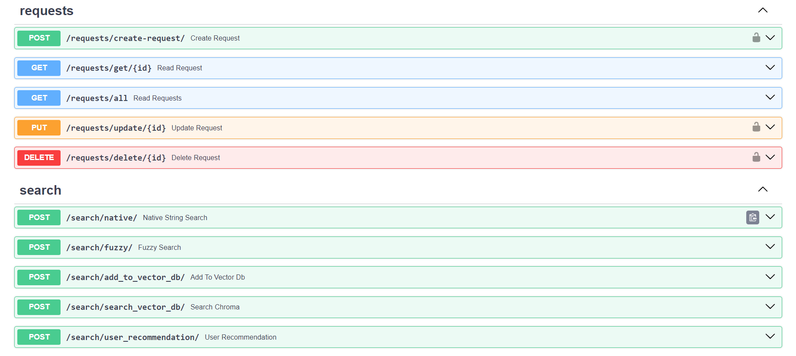

# 👨‍🌾Grull Netropolis

RestAPI for the the Netroplis app defined for Grull assignment. Written in FastAPI (python). Implements all standard authentication and database practises. Makes use of ChromaDB (vector database) which will require containerization during deployment. Dockerfile is provided with the project too.


## 🌱 Run Locally

Clone the project

```bash
  git clone https://github.com/HonestFreak/Grull_Assignment.git
```

Go to the project directory

```bash
  cd Grull_Assignment
```

Install dependencies

```bash
  pip install -r requirments.txt
```

Add and update .env file

```bash
FROM_EMAIL = # Verification Email
EMAIL_PASSWORD = # Password of verification email
URL = # Deployed URL
HOST = # SMTP server url of email
PORT = # Port of SMTP server (usually 587)
```

for testing purpose, you can use dummy email created by me (messages will be sent to spam folder)

```
FROM_EMAIL = "grull-assignment@outlook.com"
EMAIL_PASSWORD = '1@2@3@4@'
HOST = "smtp-mail.outlook.com"
PORT = 587
```

Start the server

```bash
  uvicorn main:app --reload
```
Goto local_url/docs to access the swagger ui 


## 🚀 Deployment

To develop image of this project, run

```bash
  docker build . -t "username/grull:v1.0"
```
Upload on hub.docker.io and deploy it on any cloud provider : Azure, AWS, Render etc.

Make sure to configure environment variables mentioned above.

For production purposes, I would advise to use a seperate Postgresql instance in your cloud provider and connect it with the backend by directly updating the .env (rest will be automatically done by the code)

Also it's better to run chroma image seperately 
`docker pull chromadb/chroma`
and connect it to the backend at apis/route_quest_search ->
change line 10 :
```
client = chromadb.PersistentClient(path="/chroma/")
```
to
```
client = chromadb.HttpClient(host='url', port=8000)
```

## 🦧 API Reference

API route functions could be found at
```
apis/version1
-> route_login.py
-> route_quest_search.py
-> route_quests.py
-> route_request.py
-> route_tasks.py
-> route_users.py
```
Swagger UI testing could be done at `url/docs` after running locally or deployment


## 💻 Database Structure


To see the table models, goto 

```
db/models
-> quests.py
-> request.py
-> tasks.py
-> users.py
```

## 📷 Screenshots
 
 

